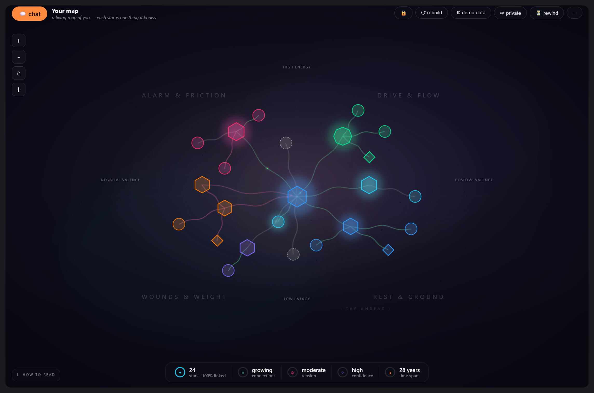
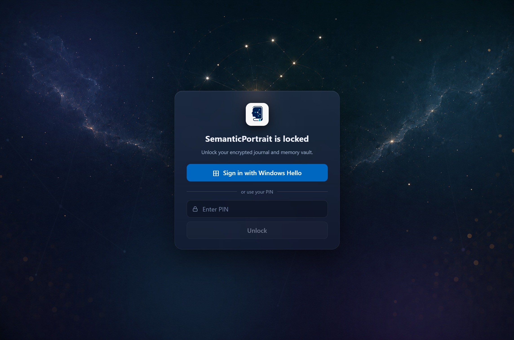

# SemanticPortrait

*One conversation, kept for a lifetime — and a quiet intelligence that learns who you are from it.*

**▶ [Watch the demo — your journal as a living star constellation](https://www.youtube.com/watch?v=ug43K83CPk8)**
 · **[Download the latest release](https://github.com/monstercameron/SemanticPortrait/releases)**

Most journaling ends where it should begin: the words go down, and nothing reads them back.
SemanticPortrait is the other half. You write to a single, unending thread, and a frontier
model listens the way a good analyst would — noticing, remembering, gently telling you the
truth. Over time it draws a portrait of you that you can actually see — a night sky where every
star is something you care about — and returns it to you when you need it most: when you're
about to believe something about yourself that isn't so.

---

## Screenshots

**Your journal as a living constellation.** Every star is one thing the analyst has learned about
you; each cluster is a theme, and a star's position encodes its energy (↕) and mood (↔).
*(Shown with sample data — your real map stays encrypted on your device.)*

**One lock over everything.** The vault is SQLCipher (AES-256) encrypted at rest and opened only
by Windows Hello or your passphrase — the database stays closed while locked.

---

## The idea

Turn an ongoing conversation into a living, self-correcting model of who you are — and let it
keep you in reality, not in your distortions.

It is built around a simple discipline most of us can't keep alone: **separate what happened
from the story you told about it.** The model records the timestamped facts, marks its own
inferences as inferences, and holds the line between the two so the record stays honest as the
years accumulate.

## Why it's worth your words

- **Your memory gets a second reader.** Everything you write is studied, indexed, and connected —
  so the one thing you said two years ago that matters *tonight* actually comes back to you.
- **You see yourself change.** The Constellation isn't clip art; every star, color, shape, and
  orbit is a deterministic function of the analysis. When your inner world shifts, the sky moves.
- **It argues with your distortions, not with you.** Rejection-radar, hope-as-fact, the inner
  critic's verdicts — named, tracked, and countered with your own recorded evidence.
- **It keeps score on itself.** Falsifiable predictions with observable criteria, checked when
  reality arrives. Calibration, not reassurance. Anti-delusion by construction.
- **It remembers your life admin too.** Reminders, events, and open loops live in the same brain —
  one question ("what's coming up?") returns your whole plate, and Windows notifications catch
  you when the app doesn't have your attention.

## What it does

- **One eternal chat thread** — your whole history in a single conversation, streamed token by
  token, rendered in clean Markdown. Nothing is ever deleted.
- **A self-updating memory.** Every meaningful exchange is studied by a background analyst that
  writes durable notes, stores stable facts about you and the people in your life, and keeps the
  record current as new information refines the old.
- **Semantic recall.** Ask about something from months ago and it finds it — a vector index over
  every entry and note surfaces the relevant past, not just the recent.
- **The Constellation.** A living map of you — people, themes, patterns, distortions, values —
  radially laid out around your core self, with named star groups, weak ties tracing back to
  what anchors them, and a sky that breathes: gas drift, meteors, stars that twinkle and sway.
- **A prediction ledger / track record.** It logs falsifiable forecasts and scores itself when
  reality arrives, so you can see — over time — where your instincts are sharp and where they lie.
- **Reminders that respect your attention.** Due items arrive in-thread when you're looking and
  as a Windows toast when you're not; quiet hours roll late-night pings to morning; a once-a-day
  digest tells you what's on your plate.
- **Inspectable thinking.** Tool calls appear as quiet reference chips in the chat ("noted this for
  later"); click one to see exactly what it recorded. A developer trace shows the full reasoning.
- **Bulk import & export.** Bring in years of old notes and prior analysis from text files — a
  pre-pass counts the facts and a live status bar tracks the work — or export your whole thread.
- **Thought compaction.** Conversations older than two days fold into a rolling summary to stay
  fast and focused; the full detail never leaves the searchable store.
- **Guided onboarding.** A short, conversational setup that gets the portrait started — and runs
  again from a clean slate if you ever erase everything.
- **Cost in the open.** Live token-usage and spend tracking, per session and lifetime — visible or
  hidden as you prefer.

## What it feels like

- **One thread, forever.** Never a new chat. Continuity *is* the product — nothing is deleted,
  edits are versioned, and the past stays the past.
- **An analyst, not a cheerleader.** The voice is calm and unsentimental. It won't flatter you,
  and it won't catastrophize with you. When you drift into rejection-radar or hope-as-fact, it
  says so — kindly, plainly.
- **It keeps score.** When you forecast something, it logs a falsifiable prediction with an
  observable criterion, then checks itself against what actually happened.
- **The Constellation.** A living mindmap of you whose colours, shapes and motion are a
  *deterministic function of the analysis itself.* Two people's portraits are comparable; none
  of it is random.

## How it stays honest

The analysis you can't argue with runs somewhere you can't reach. A **clean-room subagent** does
the durable thinking in a fresh context that never sees the live chat — so the long-term model
can't be coaxed, charmed, or talked soft by what you say in the moment. Personalization flexes
its *tone*; it never touches its *truthfulness*. New claims are researched against what's already
known before they're committed — confirmed, refined, or flagged as a contradiction — so the
portrait accretes rather than drifts.

## Security & privacy

A journal is the most sensitive document most people will ever produce, so here is the honest
version, not the marketing version.

**The trade at the center:** by default, SemanticPortrait sends your entries to a **cloud
frontier model** (OpenAI today; Claude and others on the roster) — because frankly, frontier
models are better at this job, and an analyst that misreads you is worse than no analyst. That
means the model provider processes your words under *their* privacy policy, not this app's.
Masking helps; it does not make a cloud call private. If that trade isn't acceptable to you,
switch to local inference below — the app works either way, and the choice is per-provider,
changeable at any time.

What the app itself guarantees:

- **Storage is local and encrypted, always.** No accounts, no sync, no app server, no telemetry.
  The vault is **SQLCipher (AES-256)** SQLite on your machine; the key is *derived* from your
  **Windows Hello or PIN** unlock — no copy of it sits in the clear.
- **Notifications are privacy-classified.** Before a reminder is scheduled as an OS toast, a
  classifier decides whether its text is safe for a lock screen; anything personal shows a
  generic placeholder instead — and the check *fails safe to private*.
- **PII masking on the way out.** An optional local pass pseudonymizes emails, phone numbers and
  ID numbers — **not names** — before a cloud request leaves the machine. Treat it as
  harm-reduction, not anonymity — freeform journal content (names included) can still re-identify
  you.
- **Local embeddings.** Semantic recall can run on an on-device MiniLM model, so the index that
  knows everything about you is built without a network call. Until you install it, semantic
  recall sends entry text to OpenAI for embeddings (masked by default).

### Going private: local & self-hosted inference

If you want nothing to leave your machine, SemanticPortrait speaks the OpenAI-compatible chat
protocol to **any inference server you point it at**:

- **[LM Studio](https://lmstudio.ai/)** is supported out of the box — run a local model and chat
  and analysis stay on your machine. Semantic recall stays local **only once you also install
  local embeddings** (**⋯ → Local embeddings**); until then, entry text still goes to OpenAI for
  embeddings (masked by default). With both a local model *and* local embeddings, nothing leaves.
- **Any OpenAI-compatible endpoint** works the same way — Ollama, llama.cpp's server, vLLM,
  LiteLLM, a box in your closet — the base URL is configurable in **⋯ → LLM settings**.
- **Third-party "private-ish" hosts** (a VPS you rent, a privacy-marketed inference service) sit
  in between: better than a data-hungry default, but you're still trusting someone else's
  machine. Read their retention policy; don't take "private" on faith — including from us.

Expect a quality trade: local and small hosted models are noticeably weaker analysts than
frontier models today. That gap is why the cloud is the default — and why the switch is yours
to flip, not ours.

## Built quietly underneath

A desktop application, not a website — **.NET MAUI Blazor Hybrid** on **.NET 10**, native to
Windows on ARM, light and dark. Conversations reach a model through a streaming client —
cloud (Claude / OpenAI today; Kimi, GLM and DeepSeek on the horizon) or fully local (LM Studio
and other OpenAI-compatible servers). Memory lives in **encrypted-at-rest SQLite (SQLCipher,
AES-256)** with a small vector index for semantic recall. Older turns fold into a rolling
summary; the detail never leaves the searchable store. Voice — on-device speech via the
**Snapdragon NPU** (WhisperToMe for listening, Supertonic for speaking) — is the last mile.

## Install

Download the latest **setup EXE**, **MSI**, or **portable zip** (x64 / arm64) from
[Releases](https://github.com/monstercameron/SemanticPortrait/releases) — per-user install, no
admin needed. First-run SmartScreen notes and where your data lives:
[`docs/INSTALL.md`](./docs/INSTALL.md).

## License

MIT — see [`LICENSE`](./LICENSE).

## More

- **[▶ The demo video](https://www.youtube.com/watch?v=ug43K83CPk8)** — see the constellation live.
- [`docs/INSTALL.md`](./docs/INSTALL.md) — install it as a user.
- [`docs/GETTING_STARTED.md`](./docs/GETTING_STARTED.md) — build it as a developer.
- [`CONTRIBUTING.md`](./CONTRIBUTING.md) · [`SECURITY.md`](./SECURITY.md)
